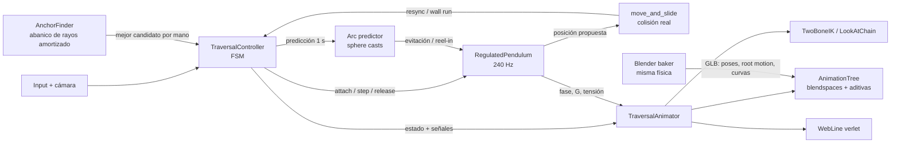
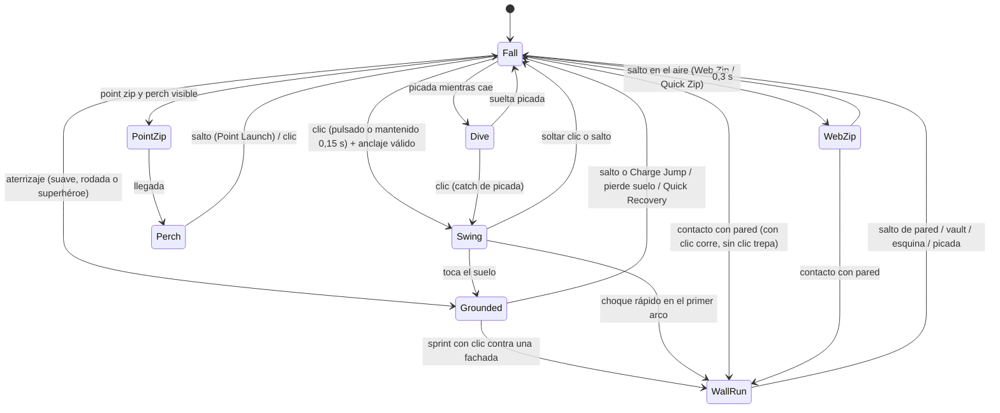

# Sistema de Balanceo estilo *Marvel's Spider-Man* (PS4) — Documento de Diseño Técnico

| | |
|---|---|
| **Rol** | Diseño de mecánicas + Dirección técnica de animación |
| **Motor objetivo** | Godot 4.3+ (GDScript). El diseño es agnóstico: el pseudocódigo de la §6 porta 1:1 a Unreal/Unity |
| **DCC** | Blender 4.2+ / 5.x (baker probado con `bpy` 5.0.1) |
| **Implementación de referencia** | [`godot/swing_system/`](../godot/swing_system) (runtime) · [`tools/swing_lab/`](../tools/swing_lab) (física, simulador, tests, baker de Blender) |
| **Estado** | Física calibrada y testeada en simulación (Python) · GDScript validado con parser/linter, pendiente de integración en escena · Baker de Blender testeado end-to-end hasta GLB |

> **Nota de rigor.** Insomniac no ha publicado las constantes de su sistema. Todo lo que sigue es una
> **reconstrucción de ingeniería** a partir del comportamiento observable del juego, con valores propios
> calibrados en un simulador (`tools/swing_lab/city_sim.py`). Cada número de la §5 se puede reproducir
> ejecutando ese simulador.

---

## 0. Pilares de diseño y arquitectura

**Pilares** (toda decisión técnica se justifica contra uno de ellos):

1. **El momento es sagrado.** Engancharse nunca frena: la velocidad se *redirige*, no se pierde (§1.3-A).
2. **Anclado a la ciudad.** La web solo se pega a geometría real; sin edificios no hay balanceo (§1.1).
3. **El arco es legible.** Cada balanceo tiene una forma reconocible (caída → fondo → subida) con duración estable ~1,4 s, sea cual sea el edificio (§1.2 pivote dinámico).
4. **Asistir sin que se note.** Las asistencias corrigen trayectoria, altitud y colisiones por debajo del umbral de percepción; la habilidad del jugador (timing de suelta, picadas) sigue decidiendo la velocidad (§1.3).
5. **La animación lee la física, nunca al revés.** Las animaciones se indexan por *fase del arco* y *fuerza G*, no por tiempo de clip (§3.3).



**Convenciones.** SI (m, s), eje **Y arriba**, masa unitaria (todas las fuerzas son aceleraciones, $\mathrm{m/s^2}$).
$\mathbf p,\mathbf v$: posición/velocidad del centro del cuerpo (caderas). $\mathbf A$: anclaje real (donde se dibuja la web).
$\mathbf P$: pivote físico. $L$: longitud de cuerda. $\hat{\mathbf n}=(\mathbf p-\mathbf P)/\lVert\mathbf p-\mathbf P\rVert$ (del pivote al cuerpo).
$\hat{\mathbf d}$: dirección de viaje horizontal. $\hat{\mathbf r}=\hat{\mathbf d}\times\hat{\mathbf y}$: derecha.
$g=9{,}81$. En el código cada símbolo tiene el mismo nombre en `swing_core.py` y `regulated_pendulum.gd`.

---

## 1. Modelo físico y mecánico base

### 1.1 Raycasting y validación de anclajes

**Regla dura:** no existen anclajes en el aire. Si no hay geometría válida (sobre el río, en medio de un parque sin árboles), no hay balanceo: el jugador cae, puede hacer *web zip* debilitado o planear en picada. Es exactamente la restricción del original y es lo que hace que la ciudad sea el *nivel*.

#### Capa de colisión `Swingable`
Solo geometría estática del mundo (fachadas, cornisas, antenas, farolas, árboles marcados). Personajes, vehículos y props físicos quedan fuera de la máscara. Superficies prohibidas se marcan con el grupo `no_web` (p. ej. cristal de un evento scriptado).

#### Punto ideal de enganche
El sistema no pregunta "¿qué hay delante?" sino "¿qué hay cerca del punto donde un anclaje produciría el arco perfecto?":

$$
\mathbf P^{*} = \mathbf p + \hat{\mathbf d}\,F\,k(v) + \hat{\mathbf y}\,U\,k(v) + \hat{\mathbf r}\,s\,S,
\qquad k(v)=\operatorname{clamp}\!\left(\frac{v}{v_{\text{target}}},\,0{,}8,\,1{,}5\right)
$$

con $F=18$ m (adelante), $U=22$ m (arriba), $S=9$ m (lateral), $s=\pm1$ la mano activa. El factor $k(v)$ **aleja el anclaje a más velocidad**: mantiene la aceleración centrípeta $v^2/L$ en un rango legible (fuerza G estable) y alarga el arco en proporción a la velocidad.

#### Abanico de rayos amortizado
- Rejilla de $4\times3\times6$ offsets alrededor de $\mathbf P^*$ (adelante $\{-8,-2,4,10\}$ m, arriba $\{-8,0,8\}$ m, lateral $\{0{,}6;\,1;\,1{,}6;\,2{,}4;\,-1;\,-2\}\cdot S$) × 2 lados = **144 rayos**.
- Origen en la mano (centro + 0,8 m). Longitud máxima 65 m.
- **12 rayos por frame** → barrido completo cada 0,2 s a 60 Hz. Coste: 12 `intersect_ray` + ≤12 sondeos de suelo por frame (despreciable).
- Los impactos van a una **caché** (máx. 48, fusión a < 1,5 m, caducidad 0,3 s). Cada consulta re-puntúa la caché con la posición actual → el mejor anclaje ya existe **antes** de que el jugador pulse (latencia de disparo 0).

#### Filtros duros (candidato inválido → puntuación −1)

| Filtro | Condición de rechazo | Motivo |
|---|---|---|
| Altura mínima | $A_y - p_y < 6$ m | Sin altura no hay arco, solo un tirón horizontal |
| Distancia | $\lVert\mathbf A-\mathbf p\rVert<L_{min}$ o $>65$ m | Cuerda degenerada / web inverosímil |
| Detrás | $(\mathbf A-\mathbf p)_{xz}\cdot\hat{\mathbf d} < -2$ m | Frenaría el avance |
| Voladizo | $n_y < -0{,}5$ | Cara inferior: la cuerda atravesaría la losa |
| Clearance | $A_y - (y_{suelo}+h_{clear}) < L_{min}$ | El arco no cabe sobre el suelo/tejado |
| Línea de visión | rayo mano→$\mathbf A$ impacta a > 0,75 m de $\mathbf A$ | Revalidado en el frame del disparo |
| Etiqueta | grupo `no_web` o fuera de la capa | Diseño de nivel |

#### Puntuación (candidatos válidos)

$$
\text{score} = 0{,}40\,s_{dist} + 0{,}25\,s_{dir} + 0{,}20\,s_{alt} + 0{,}15\,s_{lado}
$$

| Término | Fórmula | Qué premia |
|---|---|---|
| $s_{dist}$ | $1-\operatorname{clamp}(\lVert\mathbf A-\mathbf P^*\rVert/30)$ | Cercanía al punto ideal |
| $s_{dir}$ | $\left(\frac{\hat{\mathbf h}\cdot\hat{\mathbf d}+1}{2}\right)^2$ | Alineación con la dirección de viaje |
| $s_{alt}$ | $1-\operatorname{clamp}(\lvert h-U k\rvert/(U k))$ | Altura relativa ideal |
| $s_{lado}$ | $1$ si está en el lado de la mano activa, $0{,}4$ si no | Alternancia izquierda/derecha |

#### Sondeo del suelo bajo el arco
Por cada candidato nuevo se lanza un rayo vertical desde un punto 3 m hacia el jugador y 1 m fuera de la fachada. El impacto da $y_{suelo}$ **bajo el fondo del arco** (si hay un tejado más bajo, ese tejado es el suelo). Alimenta el filtro de clearance y la regulación de longitud (§1.2).

#### Altura de crucero (skyline)
Media exponencial de las alturas de anclajes vistos: $\text{skyline}\leftarrow\operatorname{lerp}(\text{skyline}, A_y, 0{,}05)$, y
$y_{crucero}=y_{suelo}+0{,}5\,(\text{skyline}-y_{suelo})$. La usan el regulador de energía y la banda de altitud (§1.3-C/D) para que el jugador no derive hacia el cielo al encadenar balanceos.

#### Alternancia de manos
Tras cada suelta `hand = -hand`. Si la mano activa no tiene candidato se prueba la otra (y se cambia de mano). Esto produce la oscilación lateral suave característica sin que el jugador tenga que pensar en ella.

### 1.2 Cinemática del péndulo regulado

#### Ecuación de movimiento
Péndulo esférico con **restricción unilateral** (la cuerda solo tira):

$$
\dot{\mathbf v} = \underbrace{-g_{eff}\,\hat{\mathbf y}}_{\text{gravedad}} + \underbrace{a_{b}\,\hat{\mathbf v}}_{\text{inyección}} + \underbrace{\mathbf a_{steer}+\mathbf a_{lane}}_{\text{control}} + \underbrace{\mathbf a_{drag}}_{\text{arrastre}} + \underbrace{\Pi_{\hat n}(\mathbf a_{ext})}_{\text{evitación}} - T\,\hat{\mathbf n},
\qquad \lVert\mathbf p-\mathbf P\rVert \le L,\;\; T\ge 0
$$

donde $\Pi_{\hat n}(\mathbf x)=\mathbf x-\hat{\mathbf n}(\mathbf x\cdot\hat{\mathbf n})$ proyecta al plano tangente.

**Gravedad asimétrica** (game feel: caída con peso, subida flotante):

$$
g_{eff} = g\cdot\begin{cases}2{,}0 & v_y<0\ (\text{cayendo})\\ 1{,}7 & v_y\ge 0\ (\text{subiendo})\end{cases}
$$

La asimetría es además una *bomba* de energía suave: se gana más energía cinética al bajar de la que se paga al subir la misma altura.

#### Tensión y fuerza G
Descomponiendo en la dirección radial $\hat{\mathbf n}$ (hacia fuera del pivote) con movimiento circular de radio $L$, la aceleración radial es $-\lVert\mathbf v_t\rVert^2/L$:

$$
-\frac{\lVert\mathbf v_t\rVert^2}{L} = -g_{eff}\,n_y - T
\;\;\Longrightarrow\;\;
\boxed{T = \frac{\lVert\mathbf v_t\rVert^2}{L} - g_{eff}\,n_y},\qquad G=\frac{T}{g}
$$

En el fondo del arco ($\hat{\mathbf n}=-\hat{\mathbf y}$): $T=v^2/L+g_{eff}$. Ejemplo típico: $v=31$ m/s, $L=27$ m → $T=35{,}6+19{,}6=55{,}2\ \mathrm{m/s^2}\approx 5{,}6\,g$ (el simulador mide 5,7 g de media). Si $T<0$ la cuerda está floja (por encima del pivote a baja velocidad) y el personaje está en caída libre dentro de la esfera. **$G$ es la variable que conduce la compresión corporal (§3.5).**

#### Integración numérica
Euler semi-implícito a **240 Hz** (sub-pasos dentro del `_physics_process` de 60 Hz) + proyección de posición:

```
v += a·h ;  p += v·h
d = |p − P|
si d ≥ L:                     # tensa
    n = (p − P)/d ;  p = P + n·L
    v_r = v·n
    si v_r > 0:                # se aleja: la cuerda lo impide
        v_antes = |v| ;  v -= n·v_r
        v *= lerp(|v|, v_antes, retention) / |v|     # preserva rapidez
```

La proyección clásica (retention = 0) disipa energía $O(h)$ por paso; con `retention` (0,92) la rapidez perdida por la proyección se devuelve en dirección tangencial. Test: un péndulo sin asistencias conserva la energía con error < 1 % en 3 s (`test_energy_conserved_and_rope_respected`).

#### Ángulo firmado y fase del arco
$$
\theta = \arccos(-n_y),\qquad
\theta_s = \begin{cases}+\theta & \mathbf v\cdot\hat{\mathbf n}_{xz}\ge 0\ (\text{subiendo, alejándose de la vertical})\\ -\theta & \text{bajando hacia el fondo}\end{cases},
\qquad
\varphi=\operatorname{clamp}\!\left(\frac{\theta_s}{75^\circ},-1,1\right)
$$

$\varphi\in[-1,1]$ es **la variable maestra de la animación**: $-1$ = recién enganchado atrás, $0$ = fondo del arco, $+1$ = ápice.

#### Pivote dinámico
Un péndulo con pivote en el anclaje real no funciona en una avenida: la web se pega a una **fachada lateral**, así que el fondo del arco estaría *pegado a la pared* y el cuerpo oscilaría de lado a lado. Se separa el **anclaje visual** $\mathbf A$ (donde se dibuja la web) del **pivote físico** $\mathbf P$, resuelto en el frame de enganche:

$$
\mathbf P = \mathbf A + \underbrace{\left(-\kappa_c\,[(\mathbf A-\mathbf p)\cdot\hat{\mathbf r}]\right)\hat{\mathbf r}}_{\text{centrado lateral}} + \underbrace{\operatorname{clamp}\!\left(h\tan\alpha^{*} - f,\;-D,\;D\right)\hat{\mathbf d}}_{\text{colocación del fondo del arco}}
$$

- $\kappa_c=0{,}65$: fracción del desplazamiento lateral que se corrige hacia la línea de viaje.
- $h=A_y-p_y$, $f=(\mathbf A-\mathbf p)\cdot\hat{\mathbf d}$. $\alpha^*=45^\circ$ es el **ángulo de ataque objetivo**: el pivote se adelanta o retrasa (hasta $D=7$ m) para que *todo* balanceo empiece a 45° de la vertical → duración y forma de arco consistentes aunque el edificio esté lejos o cerca.
- **Límite de divergencia:** si el ángulo entre $\mathbf A-\mathbf p$ y $\mathbf P-\mathbf p$ supera 22°, el desplazamiento se escala hacia $\mathbf A$. Por debajo de ~20° el ojo no percibe que la web y la trayectoria no comparten centro (el cuerpo se orienta a la web visual, §3.3).
- $L_0=\operatorname{clamp}(\lVert\mathbf p-\mathbf P\rVert, L_{min}, L_{max})$: la cuerda nace sin tirón.

Evidencia (simulador, 45 s): con $\kappa_c=0$ la altitud mínima cae de **30,6 m a 10,9 m** y la varianza de altura de enganche se multiplica ×2,8.

#### Regulación de longitud y conservación de momento angular
El fondo del arco es $y_{fondo}=P_y-L$. Cada sub-paso:

$$
L_{target}=\operatorname{clamp}\big(\min(L,\;P_y-(y_{suelo}+h_{clear})),\,L_{min},\,L_{max}\big),\qquad
L \leftarrow \operatorname{move\_toward}(L, L_{target}, 14\ \mathrm{m/s}\cdot h)
$$

Recoger cuerda es una fuerza central, así que conserva el momento angular respecto al pivote: $\lVert\mathbf v_t'\rVert = \lVert\mathbf v_t\rVert\,L_{prev}/L$. **Recoger para esquivar el suelo acelera** (como un patinador que cierra los brazos) en lugar de frenar — coherente con el pilar 1.

#### Control lateral
En el plano tangente, con $\hat{\mathbf s}_t=\operatorname{norm}(\Pi_{\hat n}(\hat{\mathbf r}_{cam}))$ y stick $u\in[-1,1]$:

$$
\mathbf a_{steer}=16\,u\,\hat{\mathbf s}_t,\qquad
\mathbf a_{lane}=-1{,}2\,(1-\lvert u\rvert)\,(\mathbf v\cdot\hat{\mathbf s}_t)\,\hat{\mathbf s}_t
$$

*Lane keeping* amortigua la deriva lateral del péndulo esférico cuando el jugador no gira.

### 1.3 Asistencias e inyección de impulso

| # | Asistencia | Dónde actúa | Fórmula / regla |
|---|---|---|---|
| A | **Catch con redirección** | Enganche | $\mathbf v_t=\mathbf v-\hat{\mathbf n}\max(0,\mathbf v\cdot\hat{\mathbf n})$; si $\mathbf v\cdot\hat{\mathbf n}>0$: $\mathbf v_t\leftarrow\hat{\mathbf v}_t\operatorname{lerp}(\lVert\mathbf v_t\rVert,\lVert\mathbf v\rVert,0{,}92)$ |
| B | **Attach kick** | Enganche | Si la componente tangencial hacia delante $<13$ m/s, se completa hasta 13 m/s |
| C | **Regulador de energía** | Fondo del arco | Campana gaussiana en $\theta_s$, ver abajo |
| D | **Banda de altitud** | Suelta | Boost vertical $\times\operatorname{clamp}(1-(p_y-y_{crucero})/12)$ |
| E | **Techos de velocidad** | Siempre | $\mathbf a=-0{,}03(v-34)^2\hat{\mathbf v}$ si $v>34$; recorte duro a 48 m/s |
| F | **Predicción y evitación** | Cada 0,1 s | Simula 1 s, *sphere cast* entre muestras (§ abajo) |
| G | **Solver propone, colisión dispone** | Cada frame | `move_and_slide` resuelve; si colisiona, resync del solver o wall run |
| H | **Ventana de suelta perfecta** | Suelta | $\lvert\theta_s-40^\circ\rvert\le9^\circ$ → boosts ×1,45 |

**A — Conservación del momento lineal al enganchar.** La física pura destruiría la componente radial de la velocidad (un jugador cayendo a 30 m/s con la cuerda a 45° saldría a $30\cos45^\circ=21$ m/s). Con retention 0,92 sale a **29,3 m/s**. Es la base de la técnica *picada → swing*: el simulador mide enganche a 57 m/s tras una picada desde 160 m y salida del balanceo a 38 m/s (vs. crucero de 25 m/s).

**C — Regulador de energía (inyección en el punto más bajo).** Predice la velocidad que se tendrá en el fondo y empuja tangencialmente solo cerca de él:

$$
v_{b}^{pred}=\sqrt{v^2+2g_{eff}\max(0,\,p_y-y_{fondo})},\qquad
v_{goal}^2 = v_{target}^2 - 2g_{eff}\,w_h\,(y_{fondo}-y_{crucero})
$$
$$
a_b = \operatorname{clamp}\!\big(k_E\,(v_{goal}-v_b^{pred}),\;0,\;a_{max}\big)\cdot e^{-(\theta_s/\sigma)^2}
$$

con $v_{target}=29$ m/s, $k_E=3\ \mathrm{s^{-1}}$, $a_{max}=18\ \mathrm{m/s^2}$, $\sigma=30^\circ$, $w_h=0{,}75$. El término de altura convierte el regulador en uno de **energía total**: si el arco pasa por encima de la altura de crucero, esa energía potencial se descuenta de la cinética objetivo y no se inyecta. Solo actúa con el gatillo mantenido y nunca frena (el frenado es tarea del techo blando E) → quien llega rápido de una picada **conserva** su exceso.

La campana concentra el empuje donde la tensión es máxima y la animación muestra la máxima compresión (§3.5): el jugador *siente* el "tirón" en el sitio donde el cuerpo lo vende.

**D — Suelta.**
$$
\mathbf v_{out}=\mathbf v + \hat{\mathbf y}\,5{,}5\,m\,u_\theta\,u_h + \hat{\mathbf d}_v\,3{,}0\,m,\qquad
u_\theta=\operatorname{clamp}(\theta_s/40^\circ),\;\; m=1{,}45 \text{ si perfecta},\;\; v_{y}\le17
$$

$u_h$ es la banda de altitud (D). **Riesgo/recompensa medida** (simulador, 60 s):

| Estilo de suelta | Crucero | Alt. mínima | Lectura |
|---|---|---|---|
| Temprana (25°) | **35,3 m/s** | 8,2 m | Rápido y bajo: técnica de experto, riesgo de calle |
| Perfecta (40°) | 24,5 m/s | 30,1 m | Crucero sostenible y estable en altura |
| Tardía (60°) | 14,5 m/s | 30,5 m | Cambia velocidad por altura |

**F — Corrección de trayectoria para evitar colisiones.** Cada 0,1 s se clona el péndulo y se integra a 30 Hz durante 1 s; entre muestras consecutivas se barre una esfera de 0,5 m (`cast_motion`). En el primer impacto, con $t_{hit}$ y normal $\hat{\mathbf m}$:

| Tipo de impacto | Condición | Respuesta |
|---|---|---|
| Suelo / tejado | $m_y>0{,}6$ | $y_{suelo}\leftarrow\max(y_{suelo},\text{impacto}_y)$ → el regulador de longitud recoge cuerda (y acelera, §1.2) |
| Pared frontal inminente | $-\hat{\mathbf m}\cdot\hat{\mathbf v}>0{,}8$ y $t_{hit}<0{,}35$ s | No se evita: se deja ocurrir y se convierte en **wall run** (§2.4) |
| Pared lateral / esquina | resto | $\mathbf a_{ext}=22\,(1-t_{hit}/1\,\text{s})\,\hat{\mathbf m}_{xz}$ proyectada al plano tangente |

**Evidencia agregada** (misma ciudad, mismo piloto, 60 s):

| Métrica | Péndulo físico sin asistencias | Péndulo regulado |
|---|---|---|
| Velocidad de crucero | 6,4 m/s | **24,5 m/s** |
| Colisiones con fachadas | 11 | **0** |
| Desviación lateral máx. | 39,1 m | **6,5 m** |
| Altitud mínima | 3,9 m | **30,1 m** |

---

## 2. Máquina de estados (FSM) y disparadores de animación

### 2.0 Moveset del original y cómo se implementa

Referencia: el moveset de traversal de *Marvel's Spider-Man* (2018) según guías públicas del juego ([Red Bull](https://www.redbull.com/ca-en/marvel-spiderman-tips-web), [Gamepur](https://www.gamepur.com/news/spider-man-ps4-web-swinging-button-layout), [Twinfinite](https://twinfinite.net/guides/spider-man-ps4-swing-around-building-corners-how/), [PSU](https://www.psu.com/news/spider-man-ps4-skill-tree-what-skills-does-spidey-have/), [Newsweek](https://www.newsweek.com/spiderman-ps4-beginners-guide-tips-tricks-1110064)). Mapeo de mando PS4 → demo (teclado / mando Xbox):

| En el original | Comportamiento | En la demo | Diferencia deliberada |
|---|---|---|---|
| **R2** en el aire | Balanceo; mantenido tras un salto dispara la siguiente web | Clic izq / RT | **Mantener = misma telaraña** (petición de diseño): el péndulo no se suelta solo y acaba colgado (§2.1) |
| **X** en pleno swing | En el punto más bajo lanza hacia delante; al final del arco, hacia arriba | Espacio / A | Mezcla continua según $\theta_s$ (§2.1) |
| **X** en el aire | *Web Zip*: impulso hacia delante que corrige el rumbo | Espacio / A o E / X | — |
| *Quick Zip* (habilidad) | Segundo zip sin perder altura | Zip dentro de 1 s del anterior | — |
| **L2+R2** | *Zip to Point* a un punto de posado | Q, clic der / LT | — |
| *Point Launch Boost* | X justo al tocar el punto = lanzamiento mucho mayor | Espacio en 0,22 s | — |
| **R2** en suelo/pared | Sprint/parkour; en una pared, correr hacia arriba | Clic mantenido | — |
| Pared sin R2 | Trepar | Soltar el clic en la pared | — |
| **X** en la pared | Web hacia arriba de la fachada y tirón | Espacio corriendo en vertical | En horizontal o trepando, X es salto de pared |
| **○** cerca de una esquina | Web a la esquina y la rodea sin perder velocidad | Mayús / B corriendo por la pared | Sin ○: *corner launch* (sale despedido) |
| *Charge Jump* (habilidad) | Cargar en el suelo y soltar para un salto enorme | Mantener Espacio / A | — |
| *Quick Recovery* (habilidad) | X durante la rodada al aterrizar relanza al aire | Espacio durante la rodada | — |
| **L3** | Picada para ganar velocidad | Mayús / B mantenido | Mantenido en vez de toque |
| **○+△ + stick** | *Air Tricks* según la dirección | F / Y + dirección | 5 trucos: voltereta adelante/atrás, tirabuzón izq./der., giro |



**Prioridad de transiciones** (en este orden dentro de cada estado): colisión→pared > suelo→Grounded > input explícito (salto, zip, point zip) > clic de swing > temporizadores. El salto usa un **buffer de 0,15 s** para que una pulsación ligeramente temprana cuente (esencial para Point Launch). Tras dejar una pared hay 0,25 s de enfriamiento antes de volver a pegarse (evita bucles de entrar/salir en cornisas y esquinas).

**Parámetros que publica la capa física** (los consume `TraversalAnimator`):

| Parámetro | Tipo | Origen |
|---|---|---|
| `State`, `Hand` | enum, ±1 | FSM |
| `SwingPhase` $\varphi$ | −1..1 | péndulo |
| `SwingAngle` $\theta_s$ | grados | péndulo |
| `GForce` | g | péndulo ($T/g$) |
| `Taut` | bool | péndulo |
| `Speed`, `VerticalSpeed`, `HorizontalSpeed` | m/s | cuerpo |
| `Steer` | −1..1 | input |
| `Aggressiveness` | 0..1 | animador (histéresis 22/26 m/s) |
| `IsFalling` | bool | $v_y<0$ en Fall/Dive |
| `WallNormal`, `WallVertical`, `WallCrawl` | vec3, bool, bool | pared (correr / trepar) |
| `Sustain` | bool | péndulo sostenido (colgado) |
| `JumpCharge`, `LandKind`, `TrickIndex` | 0..1, enum, enum | suelo / trucos |
| Señales | `web_fired(hand, A)`, `web_released(hand, perfect)`, `landed(v)`, `wall_run_started(vert)`, `point_launched(perfect)`, `trick_started()`, `jumped(charge)`, `quick_recovered()`, `corner_turned(launched)` | FSM |

### 2.1 Web Swing (arco del péndulo) y colgado

**Física:** `RegulatedPendulum.step` a 240 Hz; el cuerpo se mueve con `move_and_slide` hacia la posición propuesta; predicción F cada 0,1 s.

**Mantener el clic = misma telaraña.** No hay suelta automática. El primer arco se comporta como en §1 (inyección, gravedad asimétrica, *catch*). En la **primera inversión** del arco ($\theta_s$ pasa de $>3^\circ$ a $<0$) el péndulo entra en **modo sostenido**:

$$
g_{eff}=2{,}0\,g\ \text{(simétrica)},\qquad
\mathbf a \mathrel{-}= c\,\Pi_{\hat n}(\mathbf v),\ c=0{,}75\ \mathrm{s^{-1}},\qquad
\mathbf P \leftarrow \mathbf P+(\mathbf P_{hang}-\mathbf P)\,(1-e^{-0{,}8\,h}),\qquad
\dot L = -u\,v_{reel}
$$

- Sin inyección: la gravedad asimétrica bombearía energía en cada oscilación y nunca se pararía; con gravedad simétrica y amortiguación la amplitud cae como $e^{-ct/2}$ (dos oscilaciones visibles y quieto a los ~7–15 s según la longitud de cuerda).
- $\mathbf P_{hang}=\mathbf A+\widehat{(\mathbf P-\mathbf A)}_{xz}\cdot\min(1\,\text{m},\lVert(\mathbf P-\mathbf A)_{xz}\rVert)$: el pivote regulado vuelve al anclaje real, separado 1 m de la fachada hacia el lado de la calle, para que colgado quedes **justo bajo la telaraña** y no torcido.
- $u\in[-1,1]$ = W/S: subir/bajar por la telaraña a 5 m/s ($L\ge4$ m; nunca por debajo del *clearance*). Subir conserva el momento angular (§1.2).
- Chocar contra una fachada en modo sostenido **no suelta la web**: el cuerpo roza y sigue colgado. Solo el primer arco, a más de 4,5 m/s, se convierte en wall run (como en el original).

Tests: `HoldToHangTests` (Python) comprueban que no hay suelta, que queda quieto bajo el anclaje y el reel. En Godot, el escenario `--scenario=hang` mantiene el clic: una sola web, quieto a los 6,9 s, y W sube de 12,6 m a 5,1 m de cuerda.

**Salidas del estado:** soltar el clic (suelta manual, evalúa ventana perfecta) · salto (*swing jump*, abajo) · tocar el suelo · choque rápido en el primer arco (wall run).

**Swing jump según la fase** (como en el original): con $t=\operatorname{smoothstep}(5^\circ,45^\circ,\theta_s)$,
$$
\Delta\mathbf v = m\left[\hat{\mathbf d}\,\operatorname{lerp}(9,\,2,\,t) + \hat{\mathbf y}\,\operatorname{lerp}(3,\,9,\,t)\right],\qquad m=1{,}45\ \text{si cae en la ventana perfecta}
$$
En el fondo del arco sale disparado hacia delante; al final del arco, hacia arriba. Colgado y casi quieto, el salto es un impulso vertical de 12 m/s ("saltar desde la telaraña").

| Sub-fase | Condición | Física dominante | Animación (lógica exacta) |
|---|---|---|---|
| **Disparo** | $t<0{,}09$ s desde `web_fired` | Péndulo ya activo (sin latencia de input) | `FireL/FireR` OneShot aditivo de tren superior (fade-in 0,03 s). `WebLine` en `SHOOTING`: la punta viaja 0,09 s con latigazo lateral. `LookAt` al anclaje. |
| **Caída asistida** | $\varphi<-0{,}2$ | Gravedad ×2,0, cuerda tensándose | Blendspace `Swing_*` en $\varphi\in[-1,-0{,}2]$ (Catch→Drop). IK de mano sube con $T$. Piernas recogiéndose por overlap. |
| **Arco bajo (tensión máx.)** | $\lvert\varphi\rvert\le0{,}2$ | Pico de $T$ (4–7 g), inyección gaussiana | `Swing_*` en Bottom. Aditiva `GLoad` = $\operatorname{clamp}((G-1)/5)$. IK de mano = 1 (brazo recto sobre la web). Mano libre agarra la web si `Aggressiveness`>0. |
| **Arco ascendente** | $\varphi>0{,}2$ | Gravedad ×1,7 (flotación) | `Swing_*` hacia Apex. La cabeza **ya mira al próximo anclaje** (anticipación). `GLoad` cae. Ventana perfecta en $\theta_s\in[31^\circ,49^\circ]$. |
| **Sostenido / colgado** | tras la 1.ª inversión con clic mantenido | Amortiguado, gravedad simétrica, pivote → anclaje | Con $v>6$ m/s sigue el blendspace de swing; por debajo, pose `Hang`: las dos manos en la web, piernas colgando con retraso respecto a la velocidad (inercia); al subir o bajar, mano sobre mano. HUD: *COLGADO*. |
| **Suelta** | `web_released` | Boost D + swing jump | `Release_Flip` (voltereta) si $v>20$ m/s; tirabuzón con voltereta si es perfecta; si no `Release_Neutral`; luego `Fall`. `WebLine` en `RELEASED`. |

El nodo es `Swing_R` o `Swing_L` según `Hand`; ambos reciben `blend_position = (φ, Aggressiveness)`.

### 2.2 Web Zip, Quick Zip y Point Launch

**Web Zip** (salto en el aire, o su botón propio):
$$
\mathbf v \leftarrow \hat{\mathbf d}_{cam}\max(\mathbf v\cdot\hat{\mathbf d}_{cam},\,26\,\beta) + 0{,}3\,\Pi_{\hat d}(\mathbf v_{xz}) + \hat{\mathbf y}\,u_z
$$
con $u_z=\max(0{,}2\,v_y,\,5)$. **Quick Zip:** si el zip anterior fue hace menos de 1 s, $u_z=\max(u_z,\ \max(v_y,0)+5)$: el segundo zip no pierde altura. Durante 0,3 s gravedad ×0,2. Enfriamiento 0,25 s. Requiere geometría a ≤ 45 m en la dirección de la cámara ($\beta=1$); sin ella es un *dash* sin web visual con $\beta=0{,}6$ (pilar 2).
*Animación:* `FireL`+`FireR` simultáneos → nodo `WebZip` (`WebZip_Pull` loop) → al expirar, `WebZip_End` (voltereta corta) → `Fall`.

**Point Zip → Perch → Point Launch:**
- Objetivos: nodos del grupo `perch_points` (generados sobre esquinas de azoteas; en la demo, retícula amarilla) con $\cos\angle(\text{cámara},\text{objetivo})>0{,}85$, ≤ 45 m y línea de visión.
- Viaje a 38 m/s con arranque suave (`smoothstep` 0,12 s), guiado por la web (no se engancha en aristas).
- Llegada → `Perch`. Salto dentro de **0,22 s** tras llegar (o hasta 0,15 s antes, por el buffer) = **Point Launch Boost**: $\mathbf v=1{,}25\,(18\,\hat{\mathbf d}+19\,\hat{\mathbf y})$ y voltereta; fuera de ventana ×1.
- *Animación:* `PointZip_Fire` → `PointZip_Travel` (loop, cuerpo alineado con la web) → `Perch_Land` (root motion, 6 f) → `Perch_Idle` → `PointLaunch_Jump` o `PointLaunch_Flip` (perfecto).

### 2.3 Air Tricks, Dive y caída libre

**Caída libre (Fall):**
$$
\mathbf a = -1{,}8g\,\hat{\mathbf y} - 0{,}011\,\lvert v_y\rvert v_y\,\hat{\mathbf y} - 0{,}04\,\mathbf v_{xz} + 7\,\mathbf u_{xz}
\quad\Rightarrow\quad v_{term}=\sqrt{1{,}8g/0{,}011}=40\ \mathrm{m/s}
$$
El arrastre horizontal es casi nulo (0,04 s⁻¹): el momento de la suelta se conserva durante todo el vuelo.

**Picada (Dive):** gravedad ×2,6, arrastre 0,0076 → $v_{term}=58$ m/s, +4 m/s² hacia delante. Entra con el botón de picada si $v_y<0$. El valor de la picada está en la salida: al engancharse, el *catch* (A) redirige la velocidad vertical a tangencial (57 m/s de entrada, pico de 48 m/s limitado por el techo duro).

**Air Tricks por dirección** (como ○+△+stick en el original; puramente expresivos, 0,6 s, bloqueados en picada): adelante = voltereta adelante, atrás = voltereta atrás, izquierda/derecha = tirabuzón con brazos en cruz, sin dirección = giro doble.

| Estado | Blend / clip | Parámetros |
|---|---|---|
| Fall | BlendSpace2D `Fall`: X = $\lVert\mathbf v_{xz}\rVert/40$, Y = $v_y/40$ | Muestras: `Fall_Rise_Slow`, `Fall_Rise_Fast`, `Fall_Apex_Hang` (0,0), `Fall_Idle`, `Fall_Fast` |
| Dive | BlendSpace1D `Dive`: $v/58$ | `Dive_Loop_Slow` → `Dive_Loop_Fast`; entrada `Dive_Enter` (0,3 s) |
| Dive→Swing | transición 0,10 s | `Dive_Exit_Catch_L/R` como primera muestra del blendspace de swing ($\varphi\approx-1$) |
| Trick | OneShot (fade 0,1/0,2 s) | `AirTrick_Front/Back/RollL/RollR/Spin` según `TrickIndex` |

### 2.4 Pared: Wall Run, Wall Crawl, esquinas y cornisas

**Entrada** (desde Fall, WebZip, sprint en el suelo, o el primer arco del swing) cuando una colisión tiene $\lvert m_y\rvert\le0{,}3$. **Con el clic mantenido y $v\ge4{,}5$ m/s se corre; sin clic, se trepa (queda pegado).** Ángulo de aproximación $\gamma=\angle(\mathbf v,-\hat{\mathbf m})$:

| Modo | Condición | Movimiento |
|---|---|---|
| Carrera vertical | clic, $\gamma<40^\circ$ | $v_{wall}=\max(0{,}85\,v,\,9)$ hacia arriba; mientras se mantiene el clic decae a 9 m/s y **se sostiene** (sube edificios enteros) |
| Carrera horizontal | clic, $\gamma\ge40^\circ$ | a lo largo de la tangente, nivelada; se sostiene con el clic |
| Trepar (*wall crawl*) | sin clic | stick relativo a la pared a 5 m/s, sin gravedad; quieto si no hay input |

Soltar el clic corriendo = pasar a trepar; volver a mantenerlo = correr hacia donde apunte el stick (arriba por defecto). Si venía de un swing, la web se suelta (`web_released`). **Nunca hay un golpe seco contra la pared**: la energía se reorienta (pilar 1).

**Acciones:** salto corriendo en vertical = **tirón de telaraña** hacia arriba (+14 m/s, máx. 30) · salto trepando o en horizontal = salto de pared $11\,\hat{\mathbf m}+9\,\hat{\mathbf y}+0{,}6\,\mathbf v_{xz}$ · picada trepando = soltarse.

**Cornisa:** si al subir el rayo del pecho deja de ver pared, *vault*: un rayo hacia abajo desde encima del borde encuentra la azotea y el personaje queda de pie sobre ella (antes empujaba contra el borde y rebotaba; corregido).

**Esquinas:** exterior trepando = se rodea sola; exterior corriendo con la picada pulsada (buffer 0,5 s) = web a la esquina y la rodea **sin perder velocidad** (nueva normal $=\hat{\mathbf t}$, nueva tangente $=-\hat{\mathbf m}$, colocación por raycast sobre la cara contigua); sin picada = ***corner launch*** $\mathbf v=\hat{\mathbf t}(v_{wall}+6)+6\,\hat{\mathbf y}$ con voltereta. Interior = al chocar con la cara contigua, pasa a ella.

*Animación:* corriendo, el cuerpo se reorienta con **la pared como suelo** (`up = normal`, `forward = +Y` o tangente) y se reutilizan ciclos de carrera. Trepando, pegado a la fachada (`up` = arriba sobre el plano de la pared, `forward = -normal`) con extremidades abiertas y diagonales alternas al moverse. IK de pies contra la pared. HUD: *TREPANDO*.

### 2.5 Suelo: sprint, Charge Jump, aterrizajes y Quick Recovery

- **Sprint:** clic mantenido + dirección → 14 m/s (9 sin clic). Contra una fachada → carrera vertical. Saltar con el clic mantenido dispara la telaraña en el aire (como R2+X en el original).
- **Charge Jump:** mantener salto carga en 0,7 s; al soltar $v_y=\operatorname{lerp}(9,\,25,\,c^2)$ + 4c m/s hacia delante. Un toque = salto normal. El personaje se agacha en proporción a la carga (*squash*) y el HUD muestra el %.
- **Aterrizaje:** $\lvert v_y\rvert>25$ → **superhéroe** (rodilla y puño al suelo, frena, 0,7 s); $\lVert\mathbf v_{xz}\rVert>8$ → **rodada** (voltereta, conserva inercia, 0,45 s); si no, suave.
- **Quick Recovery:** salto durante la rodada → vuelve al aire con $\max(v_{xz},12)$ hacia delante y 13 m/s hacia arriba.

---

## 3. Sistema completo de animación y proceduralidad

### 3.1 Listado de animaciones clave

Todas a 30 fps. **Pose** = clip de 1–4 frames usado como muestra de blendspace (lleva viento/overlap procedural encima). `L/R` = variante por mano (la izquierda puede generarse por espejo en el baker, §4.3). **RM** = root motion consumido por el runtime.

| Grupo | Clip | Tipo | Frames | RM | Uso |
|---|---|---|---|---|---|
| Swing | `Swing_Catch_L/R` | Pose ($\varphi=-1$) | 1–4 | – | Cuerpo estirado recibiendo el tirón |
| | `Swing_Drop_L/R` | Pose ($-0{,}5$) | 1–4 | – | Caída asistida, rodillas subiendo |
| | `Swing_Bottom_L/R` | Pose ($0$) | 1–4 | – | Tensión máxima: piernas adelantadas, torso arqueado |
| | `Swing_Rise_L/R` | Pose ($+0{,}5$) | 1–4 | – | Barrido de piernas, pecho abriéndose |
| | `Swing_Apex_L/R` | Pose ($+1$) | 1–4 | – | Extensión total, mano libre buscando la siguiente web |
| | `Swing_*_Aggr_L/R` | Pose | 1–4 | – | Set agresivo (split, rodillas al pecho, giro de cadera) |
| | `Swing_Fire_L/R` | OneShot aditivo (tren sup.) | 6–8 | – | Extensión de brazo + muñeca ("thwip") |
| | `Swing_GLoad_Compress` | Aditiva | 1 | – | Squash: columna comprimida, rodillas al pecho |
| | `Swing_Lean_L/R` | Aditiva | 1 | – | Inclinación al girar (Add3) |
| | `Swing_LowSkim_L/R` | Pose (opcional) | 1–4 | – | Arco a < 6 m del suelo (pies "corriendo" en el aire) |
| Suelta | `Release_Neutral` | OneShot | 12–15 | – | Suelta estándar |
| | `Release_Flip_Front`, `Release_Flip_Side_L/R`, `Release_Corkscrew` | OneShot | 18–22 | – | Suelta perfecta / alta velocidad |
| | `Release_Reach_L/R` | OneShot | 10 | – | Encadenado: el brazo ya busca la siguiente web |
| Aire | `Fall_Rise_Slow/Fast`, `Fall_Apex_Hang`, `Fall_Idle`, `Fall_Fast` | Loop | 16–24 | – | Blendspace 2D de caída |
| | `Dive_Enter` | OneShot | 10 | – | Transición a cabeza abajo |
| | `Dive_Loop_Slow/Fast` | Loop | 16 | – | Brazos pegados; a velocidad terminal, vibración procedural |
| | `Dive_Exit_Catch_L/R` | Pose | 4 | – | Salida de picada hacia swing |
| | `AirTrick_01..08` | OneShot | 18–30 | – | Trucos (corkscrew, split, superman, backflip-twist…) |
| Zip | `WebZip_Fire`, `WebZip_Pull`, `WebZip_End` | OneShot/Loop | 5/8/10 | – | Zip horizontal |
| | `PointZip_Fire`, `PointZip_Travel` | OneShot/Loop | 5/8 | – | Hacia el perch |
| | `Perch_Land`, `Perch_Idle` | OneShot/Loop | 6/40 | ✔ / – | Posado |
| | `PointLaunch_Jump`, `PointLaunch_Flip` | OneShot | 12/18 | ✔ | Lanzamiento (normal / perfecto) |
| Pared | `WallRun_Enter_V`, `WallRun_Enter_H_L/R` | OneShot | 6–8 | – | Absorben el cambio de orientación |
| | `WallRun_V_Loop`, `WallRun_H_L/R_Loop` | Loop | 16 | – | Ciclos de carrera en "marco pared" |
| | `WallRun_Corner_Out/In_L/R` | OneShot | 12 | ✔ | Esquinas |
| | `WallRun_Vault_Top`, `WallJump_Back`, `WallRun_PeelOff` | OneShot | 14/10/10 | ✔/–/– | Salidas |
| Suelo | `Land_Soft`, `Land_Roll`, `Land_Hero` | OneShot | 6/16/24 | –/✔/– | Aterrizajes |

### 3.2 Estructura del AnimationTree

```
AnimationTree (root_motion_track = Skeleton3D:root)
└─ BlendTree
   ├─ Locomotion : AnimationNodeStateMachine
   │   ├─ Grounded            (sub-árbol de locomoción terrestre, fuera de alcance)
   │   ├─ Fall                BlendSpace2D  (|v_xz|/40, v_y/40)
   │   ├─ Dive                BlendSpace1D  (v/58)
   │   ├─ Swing_L / Swing_R   BlendSpace2D  (φ ∈ [-1,1], Aggressiveness ∈ [0,1])  ← 10 poses c/u
   │   ├─ Release_Neutral / Release_Flip   (→ Fall, AT_END)
   │   ├─ WebZip · PointZip · Perch
   │   ├─ WallRun_V (loop) · WallRun_H BlendSpace1D (-1..1)
   │   └─ Land_Soft / Land_Roll / Land_Hero (→ Grounded, AT_END)
   ├─ GLoad : Add2   (in: Swing_GLoad_Compress, filtro: columna + piernas + hombros)
   ├─ Lean  : Add3   (-: Swing_Lean_L, +: Swing_Lean_R)
   ├─ FireL / FireR : OneShot (filtro: clavícula→dedos de cada brazo)
   └─ Trick : OneShot → AnimationNodeTransition (trick_01..08)
```

Los tiempos de mezcla viven en las transiciones (`xfade_time`, tabla §5.3). Las rutas de parámetros están como constantes en `traversal_animator.gd` (`P_SWING_R = "parameters/Locomotion/Swing_R/blend_position"`, etc.).

### 3.3 Animación procedimental e IK

El orden por frame es: **AnimationTree → orientación procedural de la raíz visual → IK (manos, pies) → LookAt → WebLine**. En Godot las IK son `SkeletonModifier3D` hijos del `Skeleton3D`, que se ejecutan después de la animación.

#### Orientación del cuerpo ("rope space")
La raíz visual (hija del `CharacterBody3D`) solo rota; nunca se traslada. Base destino con frente de modelo $+Z$:
$$
\hat{\mathbf y}_b=\text{up},\quad \hat{\mathbf z}_b=\operatorname{norm}(\Pi_{\hat y_b}(\text{fwd})),\quad \hat{\mathbf x}_b=\hat{\mathbf y}_b\times\hat{\mathbf z}_b,\qquad
q\leftarrow\operatorname{slerp}(q,\,q_{dest},\,1-e^{-k\,\Delta t})
$$

| Estado | up | fwd | $k$ |
|---|---|---|---|
| Swing | $\operatorname{norm}(\mathbf A-\mathbf p)$ (web **visual**) | $\hat{\mathbf v}$ | 14 s⁻¹ |
| Dive | $\hat{\mathbf v}$ (cabeza hacia la velocidad) | $\Pi(-\hat{\mathbf y})$ (pecho al suelo) | 6 s⁻¹ |
| Wall run | $\hat{\mathbf m}$ (la pared es el suelo) | $+\hat{\mathbf y}$ o tangente | 14 s⁻¹ |
| Fall / Zip | $\operatorname{norm}(\hat{\mathbf y}+0{,}015\,\mathbf v_{xz})$ (se inclina hacia la velocidad) | $\hat{\mathbf v}_{xz}$ | 6 s⁻¹ |

Alinear el cuerpo a la web **visual** (no al pivote físico) es lo que oculta el pivote dinámico (§1.2). Como los clips de swing se hornean con la raíz alineada a la web (§4.2), el runtime y Blender comparten el mismo "espacio de cuerda".

#### IK de manos (agarre de la web)
Solver analítico de dos huesos (`TwoBoneIKModifier`): codo por ley de cosenos en el plano del *pole*, rotación mínima de hombro y codo, conversión a espacio local ($R_{local}=R_{padre}^{-1}R_{global}$).
- Mano que sujeta: $\mathbf t = \mathbf s + \operatorname{norm}(\mathbf A-\mathbf s)\cdot0{,}98\,(l_1+l_2)$, con $\mathbf s$ el hombro → **bajo tensión el brazo queda recto sobre la línea de la web**.
- Peso: $w=\operatorname{smooth}(\operatorname{clamp}(G/1{,}5,0,1))$ si está tensa, si no → 0 (la animación manda cuando la cuerda está floja).
- Mano libre: agarra la web 0,28 m más abajo con peso $0{,}8\cdot\text{Aggressiveness}$.
- *Pole*: codo hacia fuera y ligeramente atrás del plano del cuerpo.
- La web se dibuja desde un `BoneAttachment3D` en la muñeca → mano y web coinciden al píxel.

#### IK de pies en paredes
En wall run, rayo desde cada cadera hacia $-\hat{\mathbf m}$ (1,6 m); target = impacto + 5 cm de la normal; peso 1 con suavizado 10 s⁻¹. Para ciclos con contacto alterno, el peso se modula con la curva `FootPlant_L/R` exportada como *curve bone* (§4.2).

#### Head tracking
`LookAtChainModifier` reparte la rotación en `spine_03 → neck → head` con pesos 0,2 / 0,3 / 0,5: cada hueso corrige su fracción del error *restante*, la cabeza termina alineada y la columna acompaña. Límite total 75°. Objetivo:

| Situación | Mira a |
|---|---|
| Swing, $\varphi<0{,}2$ | Anclaje actual |
| Swing, $\varphi\ge0{,}2$ | **Mejor candidato de la otra mano** (anticipación del siguiente disparo) |
| Fall / Zip / Wall run | Mejor candidato de la mano activa |
| Dive | $\mathbf p+0{,}8\,\mathbf v$ (suelo por delante) |

#### Web visual
`WebLine`: cinta orientada a cámara de 16 segmentos. `SHOOTING` 0,09 s (latigazo lateral $\sin(\pi u)(1-k)\cdot0{,}6$ m) → `ATTACHED` (Verlet, 8 iteraciones; holgura $\operatorname{lerp}(1{,}06, 1, \text{tensión})$) → `RELEASED` (la mano se suelta, cuelga del anclaje, fade 0,6 s).

### 3.4 Blendspaces y pose matching

**Reproducción dirigida por la física.** El error clásico es reproducir `Swing_R` como un clip de 1,4 s: en cuanto el arco dura 1,1 s o 1,9 s la pose se desincroniza de la trayectoria. Aquí el swing es un **BlendSpace2D de poses**: X = fase $\varphi$ (que sale de la geometría del péndulo), Y = agresividad. La pose en el fondo del arco coincide *siempre* con el fondo real, independientemente de la duración.

| Blendspace | Eje X | Eje Y | Muestras |
|---|---|---|---|
| `Swing_L/R` | $\varphi$ (−1, −0,5, 0, 0,5, 1) | Aggressiveness (0, 1) | 10 poses |
| `Fall` | $\lVert\mathbf v_{xz}\rVert/40$ | $v_y/40$ | 5–6 loops |
| `Dive` | $v/58$ | – | 2 loops |
| `WallRun_H` | lado (−1/+1) | – | 2 loops |

- **Suavizado:** $\varphi$ con $1-e^{-30\Delta t}$ (casi directo); `GLoad`, `Lean` y parámetros de blend con $1-e^{-12\Delta t}$; agresividad con $1-e^{-6\Delta t}$.
- **Histéresis de agresividad:** entra a > 26 m/s, sale a < 22 m/s → el set de animación no parpadea en torno a un umbral.
- **Fuerza G** no es un eje del blendspace sino una **capa aditiva** (`GLoad`): así cualquier pose de fase puede comprimirse.
- **Pose matching en la entrada.** Al pasar de Fall/Dive a Swing, el blendspace ya arranca en la fase real del enganche (≈ −0,6 por el ángulo de ataque de 45°), no en $\varphi=-1$. Para clips con tiempo (Release, Land, WallRun_Enter), se elige el frame de inicio que minimiza
  $\;E=\sum_{j\in\{manos,pies\}}\lVert\mathbf x_j-\hat{\mathbf x}_j\rVert^2 + 0{,}3\,\lVert\dot{\mathbf x}_{cadera}-\dot{\hat{\mathbf x}}_{cadera}\rVert^2\;$
  sobre una ventana de los primeros 8 frames (tabla precalculada al importar; en Godot, `start_offset` del nodo).
- **Inercialización** en vez de crossfade para cambios bruscos (enganche, impacto con pared): en el frame de la transición se captura el offset por hueso entre la pose saliente y la entrante y se amortigua con un polinomio de quinto grado en 0,15 s (Bollo, GDC 2018); solo se evalúa *una* animación, no dos. El `AnimationTree` de Godot no la trae de serie: se implementa como un `SkeletonModifier3D` que guarda el offset al recibir `state_changed` y lo decae cada frame. Alternativa barata: `xfade_time` corto con `xfade_curve` *ease-out*.
- **Marcadores de sincronía:** los loops de Fall y WallRun llevan marcadores `FootPlant_L/R` para sincronizar fases al mezclar ciclos de distinta duración.

### 3.5 Mecánica corporal (squash & stretch, overlap)

| Principio | Implementación | Variable física |
|---|---|---|
| **Squash** (compresión bajo G) | Aditiva `GLoad` = $\operatorname{clamp}((G-1)/(G_{max}-1))$, $G_{max}=6$: columna −8 %, rodillas al pecho, hombros hundidos | $G=T/g$ |
| **Stretch** (disparo y ápice) | `Swing_Fire` (brazo en extensión total 2 frames *antes* de que la web llegue) + pose `Apex` extendida | $\varphi\to\pm1$ |
| **Anticipación** | Cabeza hacia el próximo anclaje en la subida; 2–3 frames de recogida antes del Fire | $\varphi\ge0{,}2$ |
| **Overlap / follow-through** | Retrasos de fase por grupo en el baker (piernas 3–4 f, brazos 1 f, cabeza −2 f); en runtime, spring bones (Jiggle) en pelvis→piernas con $\omega=12$ rad/s, $\zeta=0{,}6$ | aceleración de la raíz |
| **Arcos** | La trayectoria **es** un arco físico; los clips se hornean sobre ese arco real (§4.2) | $\mathbf p(t)$ |
| **Timing** | Gravedad asimétrica = caída rápida y *hang time* en el ápice sin tocar la animación | $g_{eff}$ |
| **Lean** | Aditiva Add3 con el stick lateral; la raíz además se inclina hacia la aceleración percibida en Fall | `Steer`, $\mathbf v$ |
| **Viento** (velocidad terminal) | Ruido procedural de 8–14 Hz en muñecas/tobillos con amplitud $\propto (v/v_{term})^2$ | $v$ |

**Espectacularidad (cámara, fuera del alcance del runtime pero necesaria para vender la velocidad):** FOV $70^\circ\to82^\circ$ con $v$, *lag* de cámara con muelle crítico (0,25 s), pequeño *shake* (0,15 °) en el pico de tensión, líneas de velocidad por encima de 30 m/s.

---

## 4. Integración práctica con Blender

### 4.1 Rigging avanzado

**Jerarquía** (compatible con Rigify; nombres de ejemplo):

```
root                          ← root motion (suelo, bajo las caderas)
├─ torso / hips (CTRL)        ← DEF-*, ORG-*, MCH-* según Rigify
│   └─ … DEF-spine.001..006, DEF-neck, DEF-head
│       └─ DEF-upper_arm.L/R → DEF-forearm.L/R → DEF-hand.L/R
│           └─ WEB_socket.L/R        ← origen de la web (BoneAttachment3D en Godot)
├─ hand_ik.L/R (CTRL)         ← objetivo IK, hijo de root
├─ foot_ik.L/R (CTRL)
└─ CRV_SwingPhase, CRV_GForce, CRV_Tension, CRV_SwingAngle, CRV_Speed, CRV_FootPlant_L/R
                              ← "curve bones": transportan curvas en location.x
```

- **IK/FK dinámico:** propiedad `IK_FK` (0–1) por extremidad (Rigify la trae, con *snap* IK↔FK). Durante el swing, el brazo que sujeta la web va en IK hacia `hand_ik` (el baker la coloca sobre la web); el brazo libre en FK para arcos de follow-through limpios. En wall run, piernas en IK.
- **Restricciones útiles para previsualizar:** `Limit Distance` (modo *Inside*) de las caderas a un empty `SWING_Anchor` = un péndulo instantáneo para bloquear poses; `Stretch To` en un hueso-web desde `WEB_socket` al anclaje; `Damped Track` de la cabeza a un empty "próximo anclaje".
- **Correctivos del traje:** el traje es spandex, así que la simulación de tela *no* va en el cuerpo principal: se usan **shape keys correctivas** con drivers por ángulo de articulación (hombro > 90°, rodilla < 40°, compresión de columna ligada a `CRV_GForce`) y normal maps de arrugas. **Cloth** solo para variantes con partes sueltas (capucha, capa, bufanda): se simula en Blender sobre el arco horneado y se hornea a huesos (Cloth → *Bake* → cadena de huesos con `Copy Location` a vértices + *Bake Action*), porque el runtime no simula tela.
- **Soft body / jiggle:** masas musculares (glúteos, pantorrillas, pecho) como *spring bones* en runtime; en Blender se previsualizan con el add-on Wiggle 2 para tunear rigidez/amortiguamiento y copiar los valores.
- **Web en Blender:** curva `SWING_Web` (generada por el baker) con `bevel_depth`; para VFX del disparo, *Soft Body* con *goal* en los extremos sobre la curva (latigazo) o una cadena de huesos con `Spline IK`. El runtime usa Verlet (§3.3), así que Blender solo produce la **referencia de timing** del disparo (0,09 s).

### 4.2 Trajectory baking y creación de Actions

La regla que evita que animación y juego se contradigan: **Blender usa exactamente la misma física que el juego.** `blender_arc_baker.py` importa `swing_core.py` (el mismo modelo que porta `regulated_pendulum.gd`) y simula el arco con el mismo integrador de 240 Hz, muestreado a los fps de la escena.

Por frame el baker escribe:

1. **Root motion:** matriz del hueso `root` $=T(\mathbf p)\,R(\text{up}=\text{web},\ \text{fwd}=\hat{\mathbf v})\,T(0,0,-h_{cadera})\,M_{rest}$ con la conversión Y-up → Z-up $(x,y,z)\mapsto(x,-z,y)$ y el personaje mirando a −Y. El test verifica que las caderas siguen la trayectoria simulada con error < 1 mm.
2. **Poses clave adaptadas a la curva:** mezcla lineal por tramos entre las poses capturadas según $\varphi$, con **retraso de fase por grupo de huesos** (overlap: piernas 3–4 frames, brazos 1, cabeza −2 = anticipación).
3. **Fuerzas G sobre los huesos:** capa aditiva $q=q_\varphi\cdot\operatorname{slerp}(\mathbb 1,\ q_{Bottom}^{-1}q_{Compress},\ w_G)$ con $w_G=\operatorname{clamp}((G-1)/(G_{max}-1))$. La compresión aparece *donde y cuando* la física dice que hay carga, frame a frame.
4. **Mano sobre la web:** el hueso `hand_ik` se coloca en $\mathbf p+\widehat{\text{web}}\,(0{,}5+0{,}7)$ m (hombro + alcance).
5. **Curvas exportables:** `SwingPhase`, `GForce`, `Tension`, `SwingAngle`, `Speed` como *custom properties* animadas del objeto **y** como *curve bones* `CRV_*` (location.x). glTF no exporta propiedades personalizadas animadas; los huesos sí → en Godot se leen con `skeleton.get_bone_pose_position(idx).x` o se convierten en pistas de método en un *import script*.
6. **Ayudas para animadores:** empties `SWING_Anchor`/`SWING_Pivot`, curva `SWING_Trajectory` y web animada `SWING_Web`.

**Política de root motion en runtime.** El `AnimationTree` usa `root_motion_track = Skeleton3D:root`, así que el movimiento del hueso raíz **se extrae** y el esqueleto queda en el origen de la raíz visual. Lo que queda en el clip es la pose en *espacio de cuerda* (la raíz ya estaba alineada con la web), exactamente lo que el runtime necesita porque la raíz visual la orienta el código (§3.3). El root motion extraído:
- **Se ignora** en Swing, Fall, Dive y Zip (manda la física).
- **Se consume** en `Perch_Land`, `PointLaunch_*`, `WallRun_Corner_*`, `WallRun_Vault_Top` y `Land_Roll` (clips cortos donde la animación manda sobre la cápsula).
- Se usa íntegro en cinemáticas y NPCs (el arco horneado es físicamente correcto).

### 4.3 Scripting en Blender (Python)

`tools/swing_lab/blender_arc_baker.py` (CLI tras `--`, o desde el editor de texto):

```bash
# 1) Capturar poses clave (con el rig posado en Pose Mode). Se guardan en el .blend
#    (bloque de texto swing_key_poses.json): Start, Descent, Bottom, Ascent, Apex,
#    Compress y opcionalmente <Pose>_Aggr.
blender rig.blend --python tools/swing_lab/blender_arc_baker.py -- --armature Spidey --capture Bottom

# 2) Hornear lado derecho y exportar
blender -b rig.blend --python tools/swing_lab/blender_arc_baker.py -- \
    --armature Spidey --side R --entry-speed 24 --action Swing_R \
    --hand-ik hand_ik.R --curve-bones --glb out/swing_R.glb

# 3) Lado izquierdo: usa <Pose>_L si existe; si no, espeja las poses (".R"<->".L", q=(w,x,-y,-z))
blender -b rig.blend --python tools/swing_lab/blender_arc_baker.py -- --armature Spidey --side L --action Swing_L
```

Núcleo del bucle de horneado (extracto):

```python
samples, anchor, pivot = simulate_arc(SwingTuning(), side=side, entry_speed=24.0, entry_pitch_deg=20.0,
                                      anchor_forward=18.0, anchor_up=22.0, anchor_side=6.0,
                                      release_angle_deg=40.0, fps=scene.render.fps)
for s in samples:
    f = s["frame"] + 1
    root_pb.matrix = _body_matrix(s, hip_height) @ rest_root          # root motion sobre el arco real
    root_pb.keyframe_insert("location", frame=f)
    root_pb.keyframe_insert("rotation_quaternion", frame=f)
    g_w = clamp((s["GForce"] - 1.0) / (g_force_max - 1.0), 0.0, 1.0)
    for pb in arm.pose.bones:
        lagged = samples[clamp(s["frame"] - lag_for_bone(pb.name, lags), 0, n - 1)]   # overlap
        q, loc = _blend_pose(poses, phase_weights(lagged["phase"], phase_keys), pb.name)
        q = q @ Quaternion().slerp(q_bottom.inverted() @ q_compress, g_w)             # squash por G
        pb.rotation_quaternion, pb.location = q, loc
        pb.keyframe_insert("rotation_quaternion", frame=f)
```

**Automatizaciones recomendadas sobre esta base:**
- **Batch de variantes:** bucle sobre `entry_speed ∈ {16, 22, 28, 34}` × `side ∈ {L, R}` para generar `Swing_Soft_*` / `Swing_Aggr_*` y revisar visualmente dónde cambia de set la agresividad.
- **Validación de poses:** para cada frame horneado, comprobar que ningún hueso supera sus límites (`Limit Rotation` como fuente) y que la mano no se separa > 5 cm de la línea de la web.
- **Generación de perch points:** script que recorre las mallas del nivel, detecta aristas superiores convexas con ángulo diedro > 60° y longitud > 1,5 m (esquinas de azoteas, cornisas) y crea empties con la propiedad `perch_point` que el importador de Godot convierte en nodos del grupo `perch_points`.
- **Referencia de timing para el disparo de la web:** hornear la curva `SWING_Web` con *Soft Body* 0,09 s y exportarla como vídeo de referencia para VFX.

Probado: `tools/swing_lab/test_blender_baker.py` construye un rig mínimo, captura poses, hornea, verifica trayectoria (< 1 mm), curvas y mano sobre la web, y exporta un GLB con 42 canales (root, huesos de pose y `CRV_*`).

---

## 5. Parámetros de calibración y *game feel*

Los nombres coinciden con `SwingTuning` en Python y GDScript. **Fuente de verdad: `swing_core.py`**; después de tocar un valor, `python3 tools/swing_lab/city_sim.py` y los tests.

### 5.1 Física

| Parámetro | Símbolo | Valor | Unidad | Efecto / cómo ajustarlo |
|---|---|---|---|---|
| `g` | $g$ | 9,81 | m/s² | Base; no tocar, usar escalas |
| `gravity_scale_swing_down` | – | 2,0 | × | Peso de la caída. +0,4 → +1,8 m/s de crucero y +0,8 g |
| `gravity_scale_swing_up` | – | 1,7 | × | *Hang time*. 2,0 → −3,7 m/s (arcos lentos y pesados) |
| `gravity_scale_fall` | – | 1,8 | × | Caída entre balanceos |
| `gravity_scale_dive` | – | 2,6 | × | Aceleración en picada |
| `rope_min` | $L_{min}$ | 8 | m | Por debajo, el arco es un latigazo ilegible |
| `rope_max` | $L_{max}$ | 45 | m | Techo de longitud (arcos > 2 s) |
| `ground_clearance` | $h_{clear}$ | 3,5 | m | Distancia mínima del fondo del arco al suelo |
| `reel_speed` | – | 14 | m/s | Velocidad de recogida para respetar clearance |
| `pivot_center_strength` | $\kappa_c$ | 0,65 | – | 0 → altitud mín. 10,9 m e inestable; 0,9 → web visual y física divergen |
| `pivot_attach_angle_deg` | $\alpha^*$ | 45 | ° | Ángulo de ataque: forma y duración del arco |
| `pivot_shift_max` | $D$ | 7 | m | Cuánto puede moverse el pivote |
| `pivot_max_divergence_deg` | – | 22 | ° | Límite perceptivo web visual vs cuerda física |
| `speed_soft_cap` / `speed_hard_cap` | – | 34 / 48 | m/s | Techo blando (cuadrático) / duro |
| `swing_air_drag` | – | 0,0008 | 1/m | Arrastre cuadrático en el swing |
| `fall_drag` / `dive_drag` | – | 0,011 / 0,0076 | 1/m | $v_{term}$ = 40 / 58 m/s |
| `air_horizontal_damping` | – | 0,04 | 1/s | Conservación del momento horizontal en vuelo |

### 5.2 Asistencias, suelta y anclajes

| Parámetro | Valor | Efecto medido / nota |
|---|---|---|
| `catch_retention` | 0,92 | 0 (física pura) → −3,6 m/s de crucero; 1,0 → +0,1 m/s (sin margen de lectura del "tirón") |
| `attach_min_tangent_speed` | 13 m/s | Arranque de swing desde parado o salto |
| `target_bottom_speed` | 29 m/s | 25 → 23,2 m/s de crucero y 5,0 g; 33 → 25,4 m/s, 5,9 g y más deriva de altura |
| `boost_accel_max` / `boost_gain` / `boost_sigma_deg` | 18 m/s² / 3 s⁻¹ / 30° | Sin inyección: −2,2 m/s de crucero |
| `altitude_energy_weight` | 0,75 | Peso de la altura en el regulador de energía |
| `release_perfect_angle_deg` ± `window` | 40° ± 9° | Ventana de 18°: a ~28 m/s con $L\approx27$ m ($\omega\approx60^\circ$/s) son ≈ 0,3 s |
| `release_perfect_bonus` | 0,45 | 0 → 20,1 m/s de crucero; 0,9 → 27,4 m/s (demasiado dominante) |
| `release_up_boost` / `release_fwd_boost` | 5,5 / 3,0 m/s | Forma del vuelo tras la suelta |
| `release_max_up_speed` | 17 m/s | Evita lanzamientos cohete |
| `release_band_height` | 12 m | Por encima de crucero + 12 m no hay boost vertical |
| `hang_damping` / `hang_pivot_rate` / `hang_wall_offset` | 0,75 s⁻¹ / 0,8 s⁻¹ / 1 m | Péndulo sostenido: amortiguación, convergencia al anclaje y separación de la fachada |
| `reel_climb_speed` / `hang_min_length` | 5 m/s / 4 m | Subir/bajar por la telaraña colgado |
| `reattach_delay` | 0,15 s | Con el clic mantenido en el aire, espera antes de disparar (salto + clic desde el suelo) |
| `swing_jump_forward` / `swing_jump_up` / `hang_jump_up` | 9 / 9 / 12 m/s | Salto en el swing según fase / salto desde colgado |
| `sprint_speed` / `charge_jump_speed` / `charge_jump_time` | 14 m/s / 25 m/s / 0,7 s | Sprint y Charge Jump |
| `quick_recovery_window` / `quick_recovery_up` | 0,45 s / 13 m/s | Quick Recovery |
| `wall_crawl_speed` / `wall_web_pull` / `corner_launch_boost` | 5 m/s / 14 m/s / 6 m/s | Trepar, tirón de web en la pared, corner launch |
| `quick_zip_window` / `zip_cooldown` | 1 s / 0,25 s | Quick Zip |
| `steer_accel` / `lane_keep` | 16 m/s² / 1,2 s⁻¹ | Respuesta lateral / estabilidad de carril |
| `anchor_ideal_forward/up/side` | 18 / 22 / 9 m | Punto ideal (×$k(v)\in[0{,}8,1{,}5]$) |
| `anchor_min_height` / `anchor_max_distance` | 6 / 65 m | Filtros duros |
| `zip_speed` / `zip_duration` / `zip_cooldown` | 26 m/s / 0,3 s / 0,35 s | Web zip |
| `point_zip_speed` / `point_launch_*` | 38 m/s / (18, 19) m/s ×1,25 | Point launch; ventana 0,22 s |
| `wall_run_vertical_angle_deg` / `wall_run_speed_retention` | 40° / 0,85 | Vertical vs horizontal / energía conservada |
| `substep` / `predict_horizon` / `predict_interval` | 1/240 s / 1 s / 0,1 s | Coste del solver y de la predicción |

### 5.3 Animación: tiempos de mezcla y umbrales

| Transición | Blend | Tipo |
|---|---|---|
| Fall → Swing | 0,12 s | Inercialización (0,15 s) |
| Dive → Swing (catch de picada) | 0,10 s | Inercialización |
| Swing → Release_* | 0,08 s | Crossfade |
| Release_* → Fall | 0,25 s | AT_END |
| Swing → Hang (sostenido, $v<6$ m/s) | 0,25 s | Crossfade (pose colgada) |
| Fall ↔ Dive | 0,30 s | Crossfade |
| Fall → WebZip / WebZip → Fall | 0,06 / 0,20 s | Crossfade |
| Aire → WallRun_* | 0,12 s | Inercialización |
| WallRun → Fall / WallJump | 0,10 s | Crossfade |
| PointZip → Perch / Perch → PointLaunch | 0,05 / 0,03 s | Crossfade |
| Aire → Land_* / Land_* → Grounded | 0,05 / 0,20 s | Crossfade / AT_END |
| OneShot Fire (in / out) | 0,03 / 0,15 s | Aditivo tren superior |
| OneShot Trick (in / out) | 0,10 / 0,20 s | – |

| Umbral | Valor | Decide |
|---|---|---|
| Swing suave → agresivo | entra > **26 m/s**, sale < **22 m/s** | Eje Y del blendspace `Swing_*` (histéresis) |
| `Release_Flip` | suelta perfecta **o** $v>26$ m/s | Variante de suelta |
| `Fall_Fast` | $v_y<-25$ m/s | Muestra del blendspace de caída |
| `Swing_LowSkim` (opcional) | fondo del arco < 6 m sobre el suelo | Pose de arco bajo |
| `Land_Hero` / `Land_Roll` | $\lvert v_y\rvert>30$ / $\lVert\mathbf v_{xz}\rVert>10$ m/s | Aterrizaje |
| $G_{max}$ de animación | 6 g | Normalización de `GLoad` |
| Peso IK de mano | $\operatorname{clamp}(G/1{,}5)$, suavizado 10 s⁻¹ | Brazo recto sobre la web |
| Look-at | 0,2 / 0,3 / 0,5, máx. 75° | Reparto columna / cuello / cabeza |
| Orientación de la raíz | 14 s⁻¹ (swing, pared) / 6 s⁻¹ (aire) | Rigidez del alineado |

### 5.4 Resultados de calibración (reproducibles)

`python3 tools/swing_lab/city_sim.py` (avenida de 30 m de ancho, edificios de 35–140 m, piloto que suelta en la ventana perfecta):

| Métrica | Valor |
|---|---|
| Velocidad de crucero | 24,5 m/s (≈ 88 km/h) |
| Duración media de un balanceo | 1,37 s |
| Cuerda media | 27,2 m |
| Velocidad: enganche → máx. → suelta | 26,3 → 31,2 → 29,9 m/s |
| G máx. por balanceo (media / pico) | 5,6 / 7,4 g |
| Colisiones / toques de suelo | 0 / 0 |
| Picada 160 m → swing | enganche 57 m/s → pico 48 m/s (techo duro) → suelta 38 m/s |
| Velocidad terminal caída / picada | 40,1 / 57,9 m/s |

Sensibilidad (45 s por variante, un parámetro cada vez):

| Variante | Crucero m/s | Duración s | G media | Alt. mín. m | σ alt. m |
|---|---|---|---|---|---|
| Base | 24,9 | 1,38 | 5,72 | 30,6 | 1,7 |
| `target_bottom_speed` 25 / 33 | 23,2 / 25,4 | 1,59 / 1,29 | 5,02 / 5,89 | 33,5 / 23,4 | 0,6 / 2,4 |
| `gravity_scale_swing_down` 1,7 / 2,4 | 22,2 / 26,7 | 1,42 / 1,37 | 4,75 / 6,48 | 34,2 / 23,4 | 0,9 / 2,0 |
| `gravity_scale_swing_up` 1,4 / 2,0 | 25,7 / 21,2 | 1,33 / 1,50 | 5,93 / 4,97 | 31,8 / 30,6 | 2,0 / 1,4 |
| `pivot_center_strength` 0 / 0,9 | 22,9 / 24,8 | 1,63 / 1,38 | 4,64 / 5,72 | **10,9** / 24,7 | **4,7** / 2,4 |
| `catch_retention` 0 / 1 | 21,3 / 25,0 | 1,46 / 1,35 | 4,90 / 5,82 | 34,2 / 32,8 | 1,3 / 1,7 |
| `release_perfect_bonus` 0 / 0,9 | 20,1 / 27,4 | 1,45 / 1,42 | 4,79 / 6,03 | 32,8 / 26,6 | 1,3 / 2,2 |
| `boost_accel_max` 0 | 22,7 | 1,43 | 5,38 | 26,6 | 1,3 |

Lectura para el diseñador: **la velocidad se ajusta con `target_bottom_speed` y `gravity_scale_swing_down`; la estabilidad con `pivot_center_strength`; el techo de habilidad con `release_perfect_bonus`.** Las tres palancas son casi independientes.

---

## 6. Implementación de referencia (`UpdateSwingingSystem`)

Pseudocódigo C++ agnóstico del motor. La versión ejecutable es `TraversalController.update_swinging_system()` + `RegulatedPendulum.step()` (GDScript) y `RegulatedPendulum.step()` (Python, testeada).

```cpp
// ============================================================================
// Llamado una vez por frame de física (60 Hz). Unidades SI, Y arriba.
// ============================================================================
void TraversalSystem::UpdateSwingingSystem(float dt)
{
    stateTime += dt;
    jumpBuffer  = max(jumpBuffer  - dt, 0.f);
    zipCooldown = max(zipCooldown - dt, 0.f);

    // --- 1. Input y dirección de viaje -------------------------------------
    Input in = ReadInput();                                  // stick, gatillo, botones, cámara
    if (in.jumpPressed) jumpBuffer = 0.15f;
    Vec3 wish = in.camForward * in.stick.y + in.camRight * in.stick.x;
    Vec3 target = LengthSq(wish) > 0.04f ? Normalize(wish)
                : Length(Flat(body.velocity)) > 2.f ? Normalize(Flat(body.velocity)) : travelDir;
    travelDir = Normalize(Slerp(travelDir, target, 1.f - exp(-4.f * dt)));

    // --- 2. Anclajes: abanico amortizado, candidatos listos antes del input --
    anchorFinder.Scan(body.position, body.velocity, travelDir, /*raysThisFrame*/ 12);

    // --- 3. FSM ---------------------------------------------------------------
    switch (state)
    {
    case State::Swing:
    {
        // 3a. Predicción del arco cada 0.1 s -> aceleración de evitación / reel-in
        if ((predictTimer -= dt) <= 0.f) {
            predictTimer = T.predictInterval;
            avoidAccel = PredictAndAvoid(pendulum);           // §1.3-F
        }
        // 3b. Sub-pasos del péndulo regulado a 240 Hz
        int   steps = max(1, (int)ceil(dt / T.substep));
        float h     = dt / steps;
        for (int i = 0; i < steps; ++i)   // reel: W/S suben o bajan por la web si está colgado
            pendulum.Step(h, in.stick.x, in.camRight, in.swingHeld, avoidAccel, /*reel*/ in.stick.y);

        // 3c. El solver propone, la colisión real dispone
        CollisionResult hit = body.MoveTo(pendulum.pos, dt);  // move_and_slide
        if (hit.valid) {
            // Solo el primer arco (rápido) se convierte en wall run; sostenido, roza sin soltar.
            if (!pendulum.sustain && TryEnterWallRun(hit.normal, pendulum.vel)) break;
            pendulum.pos = body.position;                     // resync
            pendulum.vel = ProjectOnPlane(pendulum.vel, hit.normal);
        }
        body.velocity = pendulum.vel;

        // 3d. Transiciones: sin suelta automática. Mantener el clic = misma telaraña
        //     (el péndulo pasa a modo sostenido y acaba colgado, §2.1).
        if (jumpBuffer > 0.f)                                   { jumpBuffer = 0; Release(/*swingJump*/ true); }
        else if (!in.swingHeld)                                 Release(false);
        else if (body.IsOnFloor())                              Land();
        break;
    }
    case State::Fall:
    case State::Dive:
    {
        bool dive = (state == State::Dive);
        body.velocity += AirAcceleration(body.velocity, dive, /*zip*/ false, wish) * dt;
        body.MoveAndSlide(dt);
        if (body.IsOnFloor())                        { Land(); break; }
        if (TryWallContact())                        break;
        if (in.divePressed && !dive && body.velocity.y < 0.f) SetState(State::Dive);
        else if (dive && !in.diveHeld)               SetState(State::Fall);
        if (in.zipPressed && zipCooldown <= 0.f)     { StartWebZip(); break; }
        if (in.pointZipPressed && StartPointZip())   break;
        if (in.swingPressed || (in.swingHeld && stateTime > T.reattachDelay))
            TryAttach();                              // §1.1 + §1.3-A/B
        break;
    }
    case State::WebZip:   UpdateWebZip(dt, wish);  break;
    case State::PointZip: UpdatePointZip(dt);      break;
    case State::Perch:    UpdatePerch();           break;
    case State::WallRun:  UpdateWallRun(dt);       break;
    case State::Grounded: UpdateGrounded(dt, wish); break;
    }

    // --- 4. Parámetros de animación ------------------------------------------
    PushAnimatorParameters(dt);
}

// ----------------------------------------------------------------------------
bool TraversalSystem::TryAttach()
{
    Candidate* c = anchorFinder.BestFor(hand, body.position, body.velocity, travelDir);
    if (!c) { c = anchorFinder.BestFor(-hand, ...); if (!c) return false; hand = -hand; }
    if (!anchorFinder.ValidateLineOfSight(*c, body.position + handOffset)) return false;
    pendulum.Attach(body.position, body.velocity, c->point, travelDir,
                    c->groundY, anchorFinder.CruiseY());   // pivote dinámico + catch + kick
    SetState(State::Swing);
    Emit(WebFired{hand, c->point});
    return true;
}

void TraversalSystem::Release(bool swingJump)
{
    Vec3 v = pendulum.Release();                          // boost + ventana perfecta + banda de altitud
    if (swingJump) v.y += T.swingJumpUp * (1.f + (pendulum.lastReleasePerfect ? T.releasePerfectBonus : 0.f));
    body.velocity = v;
    Emit(WebReleased{hand, pendulum.lastReleasePerfect});
    hand = -hand;                                         // alterna manos
    SetState(State::Fall);
}

// ----------------------------------------------------------------------------
// Núcleo: un sub-paso del péndulo regulado (§1.2, §1.3)
// ----------------------------------------------------------------------------
void RegulatedPendulum::Step(float h, float steer, Vec3 camRight, bool hold, Vec3 extAccel, float reel)
{
    Vec3  n     = SafeNormalize(pos - pivot, Vec3::Down);
    float ang   = SignedAngleDeg();                               // θs
    // Péndulo sostenido: primera inversión del arco con el clic mantenido (§2.1)
    if (hold && !sustain && ((prevAng > 3.f && ang < 0.f) || (time > 0.5f && Length(vel) < 1.f)))
        sustain = true;
    prevAng = ang;
    float gEff  = T.g * ((vel.y < 0.f || sustain) ? T.gScaleSwingDown : T.gScaleSwingUp);
    Vec3  acc   = {0.f, -gEff, 0.f};
    float speed = Length(vel);
    Vec3  vHat  = SafeNormalize(vel, travel);

    // Regulador de energía con campana gaussiana en el fondo del arco
    float drop   = max(pos.y - (pivot.y - length), 0.f);
    float vPred  = sqrt(speed * speed + 2.f * gEff * drop);
    boost = 0.f;
    if (hold && !sustain) {
        float err = GoalBottomSpeed(gEff) - vPred;               // incluye término de altitud
        boost = Clamp(T.boostGain * err, 0.f, T.boostAccelMax) * Bell(ang, T.boostSigmaDeg);
        acc += vHat * boost;
    }
    // Steering + lane keeping en el plano tangente, evitación externa
    Vec3 sT = Normalize(ProjectOnPlane(camRight, n));
    acc += sT * (steer * T.steerAccel);
    acc -= sT * (Dot(vel, sT) * T.laneKeep * (1.f - fabs(steer)));
    acc += ProjectOnPlane(extAccel, n);
    if (sustain) {                                                // se apaga y va bajo el anclaje
        acc   -= ProjectOnPlane(vel, n) * T.hangDamping;
        pivot += (hangPivot - pivot) * (1.f - exp(-T.hangPivotRate * h));
    }
    // Arrastre + techo blando
    acc -= vel * (T.swingAirDrag * speed);
    if (speed > T.speedSoftCap) acc -= vHat * (T.overspeedDrag * Sq(speed - T.speedSoftCap));

    vel += acc * h;                                               // Euler semi-implícito
    pos += vel * h;

    // Regulación de longitud (clearance) + conservación del momento angular
    float lPrev   = length;
    float minLen  = sustain ? T.hangMinLength : T.ropeMin;
    if (sustain) length -= reel * T.reelClimbSpeed * h;          // W/S: subir/bajar por la web
    float lTarget = Clamp(min(length, pivot.y - (groundY + T.groundClearance)), minLen, T.ropeMax);
    length = MoveToward(length, lTarget, T.reelSpeed * h);

    // Restricción unilateral con proyección que preserva la rapidez
    Vec3  d = pos - pivot;  float dl = Length(d);
    taut = dl >= length - 1e-4f;
    if (taut) {
        n   = d / dl;
        pos = pivot + n * length;
        float vr = Dot(vel, n);
        if (vr > 0.f) {
            float before = Length(vel);
            vel -= n * vr;
            float after = Length(vel);
            if (after > 1.f) vel *= Lerp(after, before, T.catchRetention) / after;
        }
        if (length < lPrev) {                                     // spin-up al recoger
            Vec3 vRad = n * Dot(vel, n);
            vel = vRad + (vel - vRad) * (lPrev / length);
        }
    }
    speed = Length(vel);
    if (speed > T.speedHardCap) { vel *= T.speedHardCap / speed; speed = T.speedHardCap; }

    // Salidas para animación
    tension       = taut ? max(LengthSq(ProjectOnPlane(vel, n)) / length - gEff * n.y, 0.f) : 0.f;
    gForce        = tension / T.g;
    swingAngleDeg = SignedAngleDeg();
    phase         = Clamp(swingAngleDeg / 75.f, -1.f, 1.f);
}

// ----------------------------------------------------------------------------
// Capa de animación: parámetros del Animator Controller (§2, §3)
// ----------------------------------------------------------------------------
void TraversalSystem::PushAnimatorParameters(float dt)
{
    const float k = 1.f - exp(-12.f * dt);
    float speed = Length(body.velocity);

    // Histéresis suave/agresivo
    if (aggressive && speed < 22.f) aggressive = false;
    else if (!aggressive && speed > 26.f) aggressive = true;
    aggrBlend = Lerp(aggrBlend, aggressive ? 1.f : 0.f, k * 0.5f);

    bool swinging = (state == State::Swing);
    phaseSmoothed = swinging ? Lerp(phaseSmoothed, pendulum.phase, 1.f - exp(-30.f * dt)) : phaseSmoothed;
    gLoad = Lerp(gLoad, swinging ? Clamp((pendulum.gForce - 1.f) / (6.f - 1.f), 0.f, 1.f) : 0.f, k);

    animator.SetFloat ("Speed",          speed);
    animator.SetFloat ("VerticalSpeed",  body.velocity.y);
    animator.SetBool  ("IsFalling",      (state == State::Fall || state == State::Dive) && body.velocity.y < 0.f);
    animator.SetFloat ("SwingAngle",     pendulum.swingAngleDeg);
    animator.SetFloat ("SwingPhase",     phaseSmoothed);           // eje X del blendspace de swing
    animator.SetFloat ("Aggressiveness", aggrBlend);               // eje Y
    animator.SetFloat ("GForce",         gLoad);                   // capa aditiva de compresión
    animator.SetFloat ("Steer",          swinging ? in.stick.x : 0.f);
    animator.SetInt   ("Hand",           hand);
    animator.SetInt   ("State",          (int)state);

    // Procedural: raíz alineada a la web, IK de mano por tensión, mirada anticipada
    visualRoot.rotation = Slerp(visualRoot.rotation,
                                BasisFrom(/*fwd*/ body.velocity, /*up*/ BodyUpFor(state)),
                                1.f - exp(-(swinging ? 14.f : 6.f) * dt));
    handIK[hand].target    = shoulder[hand] + Normalize(pendulum.anchor - shoulder[hand]) * armLength * 0.98f;
    handIK[hand].weight    = Lerp(handIK[hand].weight, (swinging && pendulum.taut) ? Clamp(pendulum.gForce / 1.5f, 0.f, 1.f) : 0.f, k);
    lookAt.target          = (swinging && phaseSmoothed < 0.2f) ? pendulum.anchor
                           : anchorFinder.BestFor(swinging ? -hand : hand, ...)->point;
}
```

---

## Apéndices

### A. Demo jugable (Windows)

`godot/` es un proyecto de Godot 4.7 completo: `demo/` monta por código una ciudad procedural (~800 edificios), un personaje animado proceduralmente con las reglas de la §3, cámara orbital y HUD sobre el runtime de `swing_system/`. El traje (`demo/suit.gdshader`) reproduce la esfera de referencia: tela roja con microtextura hexagonal y telaraña negra brillante en relieve (radial en pecho y espalda, a lo largo de brazos y piernas), con la propia imagen de referencia proyectada como máscara (`demo/textures/suit_reference.webp`, importada con compresión S3TC). `demo/autopilot.gd` prueba el control real con tres escenarios (`tour`, `hang`, `moves`) y una pose para capturas. Exportar: abrir `godot/` en Godot 4.7 → *Proyecto → Exportar → Windows Desktop* (preset incluido, PCK embebido), o por línea de comandos `godot --headless --path godot --export-release "Windows Desktop" build/WebSwingDemo.exe`. Prueba sin interfaz: `godot --headless --path godot --fixed-fps 60 -- --autopilot=120` (recorre la ciudad y sale con un resumen JSON).

**Build reducido (28 MB).** `godot/export/build_slim_template.sh` compila una plantilla de exportación propia de Godot 4.7.2: renderer Compatibility (OpenGL 3.3) sin Vulkan/D3D12, solo los módulos que usa la demo (GDScript, FreeType, text server básico, física 3D de Godot), sin física/navegación 2D, XR ni GUI avanzada, y un *build profile* (`slim_template.build`) que desregistra 104 clases no usadas (partículas, GI, decals, sprites 3D, audio effects…) para que el enlazado con LTO elimine su código. Resultado: 109 MB → 28 MB. La misma configuración compilada para Linux reproduce exactamente la partida de referencia (mismo resumen de autopiloto) y renderiza igual.

### B. Estructura del repositorio

```
docs/DISENO_SISTEMA_BALANCEO.md      ← este documento
tools/swing_lab/
  swing_core.py                      ← física (fuente de verdad): péndulo regulado, aire, anclajes
  city_sim.py                        ← simulador de calibración (§5.4)
  blender_arc_baker.py               ← baker de Blender (§4)
  test_swing_core.py                 ← 14 tests de física y asistencias
  test_blender_baker.py              ← integración con bpy (se salta sin bpy)
godot/swing_system/
  swing_tuning.gd                    ← Resource con todos los parámetros
  regulated_pendulum.gd              ← port 1:1 de swing_core
  anchor_finder.gd                   ← §1.1
  traversal_controller.gd            ← FSM + update_swinging_system (§2, §6)
  traversal_animator.gd              ← AnimationTree, orientación, IK, web (§3)
  two_bone_ik_modifier.gd            ← IK analítica (SkeletonModifier3D)
  look_at_chain_modifier.gd          ← head tracking repartido
  web_line.gd                        ← web visual Verlet
```

### C. Montaje de la escena en Godot (con un personaje riggeado)

```
Player (CharacterBody3D + traversal_controller.gd)   capa: Player · máscara: World
├─ CollisionShape3D (Capsule r=0.4, h=1.8)
├─ AnchorFinder (Node3D + anchor_finder.gd)          swingable_mask = capa Swingable
├─ VisualRoot (Node3D)                                ← traversal_animator.visual_root
│  └─ Character (glTF importado)
│     ├─ AnimationPlayer (clips importados)
│     ├─ AnimationTree (estructura §3.2, anim_player → AnimationPlayer)
│     └─ Skeleton3D
│        ├─ TwoBoneIKModifier ×4 (manos, pies)
│        ├─ LookAtChainModifier
│        └─ BoneAttachment3D "HandSocketL/R"          ← origen de la web
├─ IKTargets (Node3D, top_level = true)
│  └─ HandL, HandR, FootL, FootR, Pole*, Look (Marker3D) ← los mueve TraversalAnimator
├─ TraversalAnimator (Node + traversal_animator.gd)
└─ WebLine (MeshInstance3D + web_line.gd, material unshaded con vertex color + alpha)
Camera rig (SpringArm3D + Camera3D) → traversal_controller.camera
```

InputMap: `move_left/right/forward/back`, `swing` (R2), `jump` (✕), `web_zip` (✕ en el aire o botón dedicado), `point_zip` (L2+R2), `dive` (○ mantenido), `trick` (□).

### D. Validación y límites conocidos

| Pieza | Validación realizada |
|---|---|
| Física (Python) | 17 tests unitarios (incl. péndulo sostenido: no se suelta, queda quieto bajo el anclaje, reel) + simulador; `python3 -m unittest discover -s tools/swing_lab` |
| Demo (Godot) | Autopiloto con escenarios `tour` (120 s), `hang` (mantener el clic: 1 sola web, quieto a los 6,9 s, W sube 12,6 → 5,1 m) y `moves` (Charge Jump al 100 %, Web/Quick Zip, truco, sprint → wall run vertical hasta la azotea → vault, trepar, salto de pared), con el motor oficial y con la plantilla slim (resultados idénticos) |
| Baker de Blender | Test end-to-end con `bpy` 5.0.1 (trayectoria < 1 mm, curvas, IK, GLB con 42 canales) |
| GDScript | Compila sin errores en Godot 4.7.2; la demo corre 120 s con autopiloto sin errores (balanceo, picada, wall run, aterrizajes) y el `.exe` exportado se validó cargando su PCK embebido. `AnimationTree`, IK de esqueleto y *look-at* no se han probado con un rig real (la demo usa un maniquí procedural) |

Límites asumidos: la locomoción terrestre, la cámara y el combate quedan fuera; el *pose matching* de entrada se especifica (§3.4) pero no está implementado; las poses clave del baker se capturan a mano.

### E. Referencias técnicas
- D. Bollo, *Inertialization: High-Performance Animation Transitions in Gears of War*, GDC 2018.
- S. Clavet, *Motion Matching and The Road to Next-Gen Animation*, GDC 2016 (base del *pose matching* de la §3.4).
- Documentación de Godot 4: `SkeletonModifier3D`, `AnimationTree`, `PhysicsDirectSpaceState3D`, `CharacterBody3D`.
